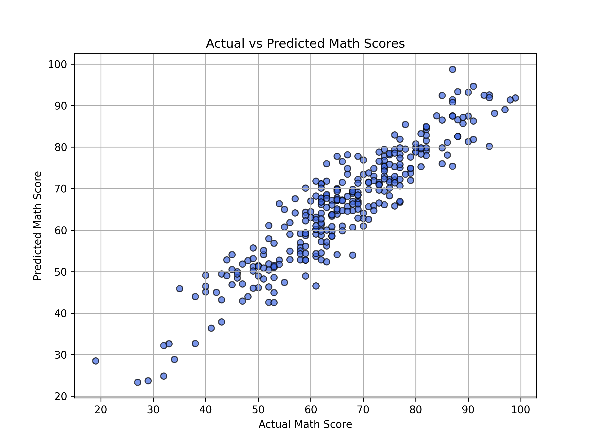

# 🧠 Student Math Score Prediction Using Linear Regression

This project explores how various student background factors impact their math scores using linear regression. It is a beginner-friendly machine learning project designed to demonstrate basic data preprocessing, feature encoding, exploratory data analysis, model training, and evaluation.

---

## 📂 Dataset

**Source:** [Kaggle - Student Performance Dataset](https://www.kaggle.com/datasets/spscientist/students-performance-in-exams)  
This dataset contains scores for math, reading, and writing, along with demographic and socio-economic attributes.

---

## 🎯 Objective

The goal is to **predict the math score** of students based on features like:

- Gender
- Race/Ethnicity
- Parental level of education
- Lunch type
- Test preparation course
- Reading and writing scores

---

## 🛠️ Tools & Libraries

- Python
- Pandas & NumPy
- Seaborn & Matplotlib
- Scikit-learn

---

## 📊 Workflow Summary

1. **Data Loading**  
   Load the dataset and explore the structure.
2. **Exploratory Data Analysis (EDA)**  
   Visualize relationships between input features and math scores.
3. **Data Cleaning & Encoding**  
   Convert categorical features using one-hot encoding.
4. **Feature Engineering**  
   Added an interaction term: `group E * master's degree`.
5. **Model Training**  
   Trained a `LinearRegression` model using scikit-learn.
6. **Model Evaluation**
   - **R² Score:** `0.856`
   - **RMSE:** `5.3`

---

## 📈 Model Performance

The model was able to explain ~86% of the variance in math scores. On average, predictions are off by about 5.3 points, which is a strong performance for this dataset.

---

## 📌 Key Visualization

> Scatterplot of actual vs predicted scores to visualize model accuracy.

---

## 🚀 Future Improvements

- Try regularization (Ridge/Lasso)
- Use polynomial or interaction features
- Apply classification to categorize score ranges (e.g., high/low performer)

---

## 🧠 Author

**Milkiyas Weldesenbet Gebrehiwet**  
Passionate about building data-driven and automated systems.  
This is my first public machine learning project — feedback is welcome!

---

## 📁 Repository Structure

student-score-prediction/
├── notebooks/
│ └── linear_regression_student_scores.ipynb
├── assets/
│ └── actual_vs_predicted.png
├── cleaned_student_score2.csv
├── StudentsPerformance.csv
├── README.md
├── requirements.txt
└── .gitignore

---

## 📎 License

This project is open-source and free to use for learning and academic purposes.
