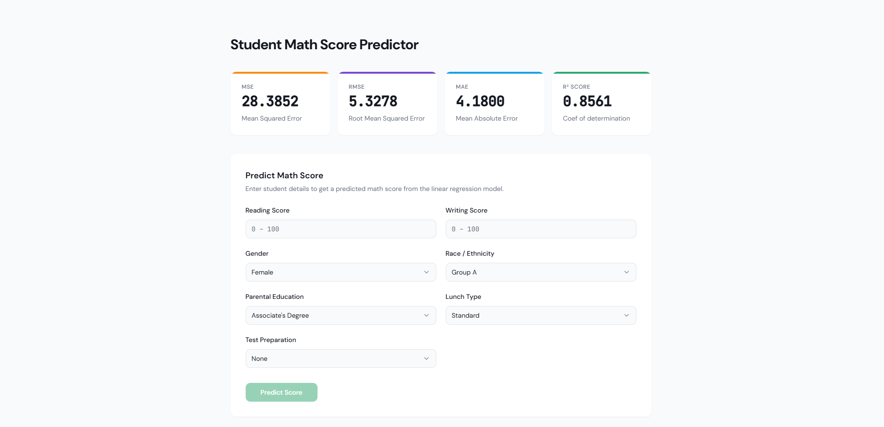
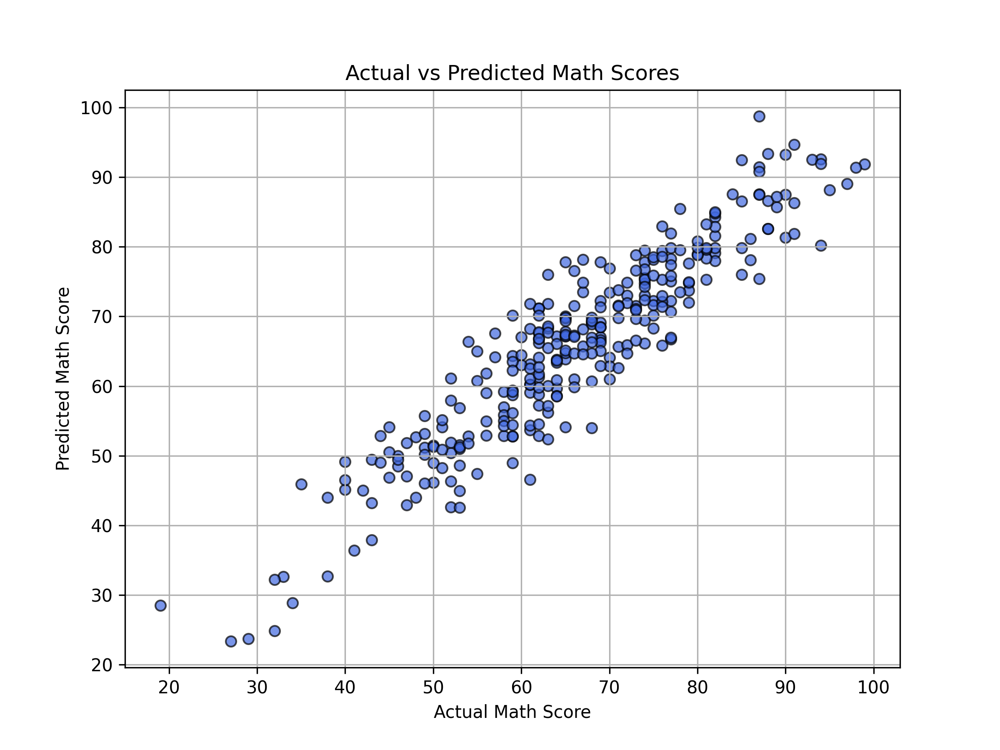

<div align="center">
  <h1>🧠 Student Math Score Predictor</h1>
  <p>A full-stack application leveraging Machine Learning to predict student math scores based on demographic and socio-economic factors.</p>
</div>

---

## 📸 Dashboard Preview

<div align="center">
  
</div>

---

## 📖 About the Project

This project explores how various student background factors impact their math scores using **Linear Regression**. Originally a machine learning analysis, it has been evolved into a complete web application featuring a **React (Vite + TypeScript)** frontend and a **FastAPI** backend to serve the model predictions in real-time.

It is designed to demonstrate:
- Basic data preprocessing and feature engineering
- Exploratory data analysis (EDA)
- Model training, evaluation, and export using `scikit-learn`
- Building and serving a machine learning API with `FastAPI`
- Creating a modern, responsive user interface with `React`, `Tailwind CSS`, and `shadcn/ui`

---

## 📌 Key Visualization: Actual vs Predicted

<div align="center">
  
  <p><i>Scatterplot of actual vs predicted scores visualizing model accuracy (~86% R² Score).</i></p>
</div>

---

## 🛠️ Technology Stack

**Frontend:**
- React 18, Vite, TypeScript
- Tailwind CSS, shadcn/ui
- React Hook Form, Zod (Form Validation)

**Backend & Machine Learning:**
- Python 3
- FastAPI, Uvicorn
- Scikit-learn, Pandas, NumPy
- Joblib (Model serialization)

---

## 📁 Repository Structure

```text
math_score_predictor/
├── frontend/                   # React frontend application
│   ├── public/                 # Static assets
│   ├── src/                    # Components, pages, hooks, lib
│   ├── package.json            # NPM dependencies
│   └── vite.config.ts          # Vite configuration
├── model/                      # Backend FastAPI & Machine Learning Model
│   ├── notebooks/              # Jupyter notebook for EDA & model training
│   ├── assets/                 # Visualizations (e.g., actual vs predicted plot)
│   ├── app.py                  # FastAPI application exposing the `/predict` endpoint
│   ├── export_model.py         # Script to export the trained model
│   ├── linear_model.joblib     # Saved Linear Regression model
│   ├── feature_names.joblib    # Saved features generated from training
│   ├── requirements.txt        # Python backend dependencies
│   └── ...
├── dashboard.png               # UI Dashboard Preview screenshot
└── README.md                   # Project documentation
```

---

## 🚀 Getting Started

Follow these instructions to run the application locally.

### 1. Clone the repository

```bash
git clone https://github.com/MikoG-dev/student-math-score-prediction.git
cd math_score_predictor
```

### 2. Backend Setup (FastAPI & Model)

Navigate to the `model` directory and set up the Python environment.

```bash
cd model

# Optional: Create a virtual environment
# python -m venv venv
# venv\Scripts\activate  # On Windows

# Install dependencies
pip install -r requirements.txt

# Run the FastAPI server
uvicorn app:app --reload
```
The backend API will be running at `http://127.0.0.1:8000`.

### 3. Frontend Setup (React App)

Open a new terminal, navigate to the `frontend` directory, and start the development server.

```bash
cd frontend

# Install dependencies
npm install

# Start the Vite development server
npm run dev
```
The frontend application will be running at `http://localhost:5173`.

---

## 📊 Dataset & Objective

**Source:** [Kaggle - Student Performance Dataset](https://www.kaggle.com/datasets/spscientist/students-performance-in-exams)  
This dataset contains scores for math, reading, and writing, along with demographic and socio-economic attributes.

The goal is to **predict the math score** of students based on features like:
- Gender
- Race/Ethnicity
- Parental level of education
- Lunch type
- Test preparation course
- Reading and writing scores

### Model Performance
- **R² Score:** `0.856`
- **RMSE:** `5.3`

The model accurately explains ~86% of the variance in math scores. On average, predictions are off by about 5.3 points, which demonstrates strong performance.

---

## 🌱 Future Improvements

- Add Docker support for easier deployment of frontend and backend environments.
- Try regularization (Ridge/Lasso) or more advanced regression algorithms (Random Forest, XGBoost).
- Expand the frontend dashboard to display real-time EDA visualizations based on the dataset.
- Implement user authentication to save user prediction history.

---

## 🧠 Author

**Milkiyas Weldesenbet Gebrehiwet**  
Passionately building data-driven and automated systems.  
This is my first public machine learning project integrated into a full web application — feedback is highly welcome!

---

## 📎 License

This project is open-source and free to use for learning and academic purposes.
